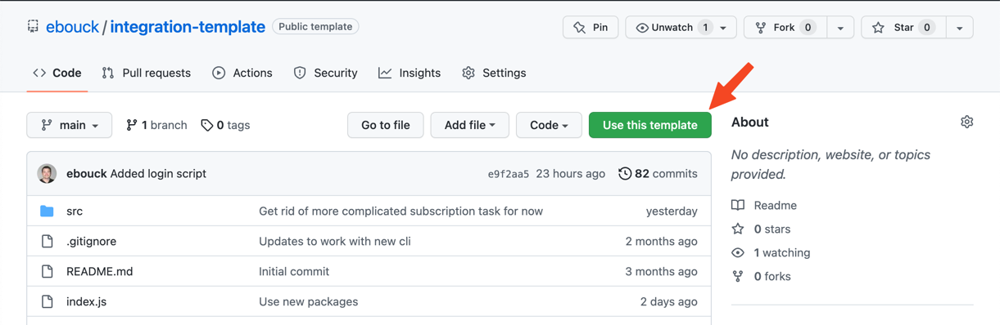
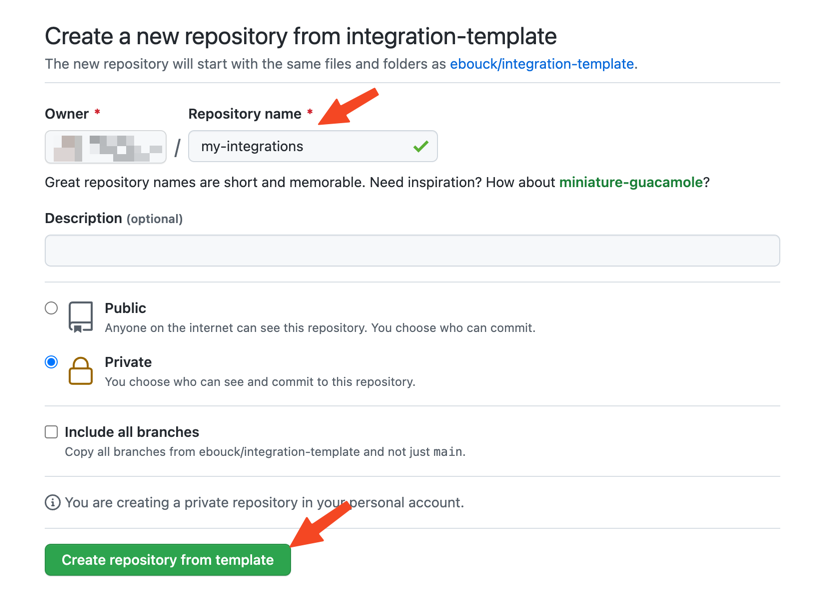

import Tabs from '@theme/Tabs';
import TabItem from '@theme/TabItem';

# Step 1 - Set Up Dev Env

## System Requirements

* A [GitHub](https://github.com/) account
* [Node](https://nodejs.org/en/) v14.20, v16.17, or greater (check with `node --version`)

## Getting Started

### Create and Clone a Repo

<Tabs>
  <TabItem value="auto" label="Automated" default>

#### Additional System Requirements

* [GitHub CLI](https://cli.github.com/)

#### On the command line

This command will create a new repo in your GitHub account from our template and clone it onto your local machine. We'll create one called `my-integrations` and refer to it as such throughout this tutorial, but feel free to use whatever name you like.

```shell
npx @bigidea/cli create my-integrations
```

  </TabItem>
  <TabItem value="manual" label="Manual">

#### Create your repo

You need to create a GitHub repo that will contain your integrations. You can start one by using our template. 

[Create from Template](https://github.com/ebouck/integration-template)

Then click "Use this template"



:::caution

If you do not see this button, make sure you are logged into GitHub and try again.

:::

And finally create the new repo by giving it a name. You'll probably want to make it private as well. We'll create one called `my-integrations` and refer to it as such throughout this tutorial, but feel free to use whatever name you like.



#### Clone your repo

Create a clone of your repo as a project on your local machine.

#### Install npm packages
Use npm to install the project packages

```shell
npm install
```


  </TabItem>
</Tabs>


### Authenticate 

<Tabs>
  <TabItem value="auto" label="Automated" default>

#### Sign Up or Sign In

Change to the directory and log in to the app using the command line.

```shell
npm run login
```

  </TabItem>
  <TabItem value="manual" label="Manual" default>

#### Create a .env file

You need to store a dev api key to connect your local environment to your online dev environment. Create a file named `.env` at the root level of your new project and set its contents to the [values you find on this page](https://integration.bigidea.io/prototype/integrations/envs/dev/setup).


  </TabItem>
</Tabs>


### Run the Dev Server

Start the dev server.
```shell
npm run dev
```

