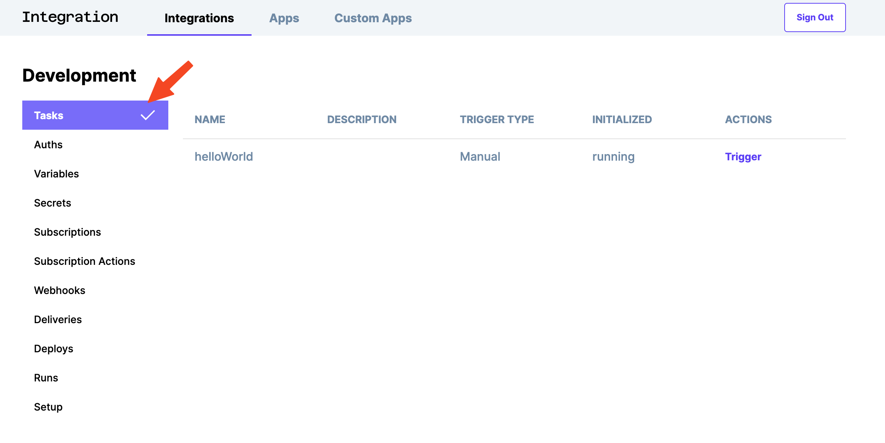
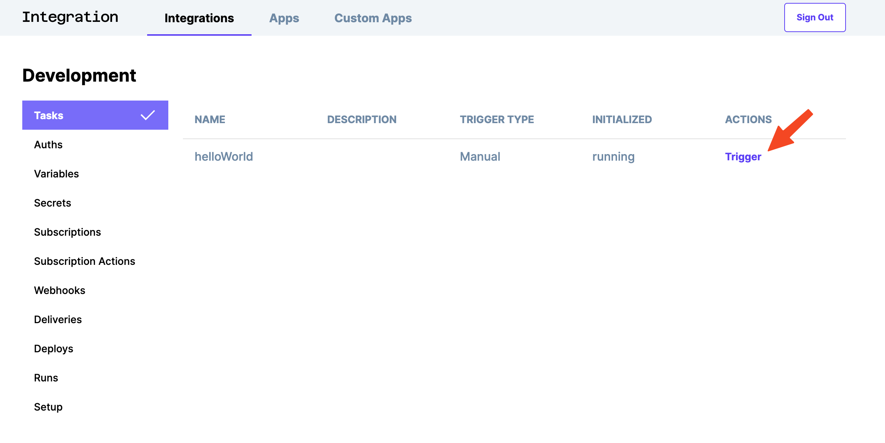
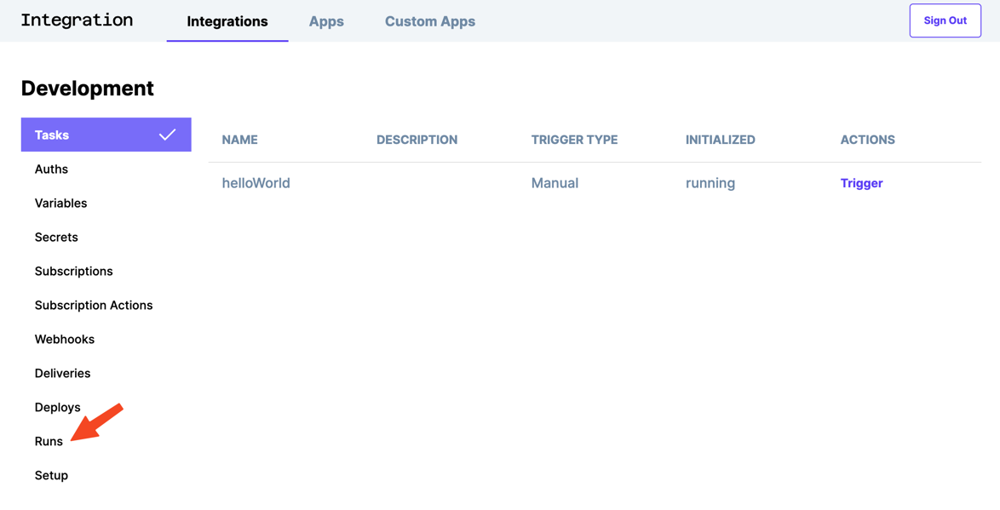
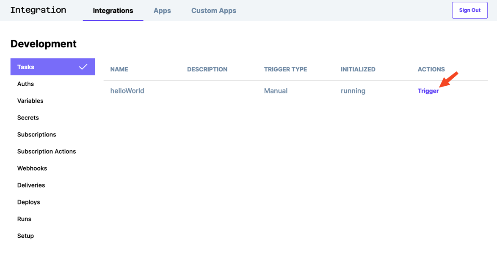

# Step 3 - Run a Task

## Visit your dashboard 

You can go to your dashboard with this link: https://integration.bigidea.io/prototype

## Select your env

There are currently two environments, `dev` and `prod`. Click on the `dev` environment.

## See the list of tasks

Selecting the tasks menu lets you view all of the deployed tasks. These correspond with the tasks in `my-integrations`.

## Run the task

To run one, click on the `Trigger` link.

## Find the run

You can view the output by clicking on `Runs`.

And then clicking on the latest run.

## Display run details

You should see something similar to this.

